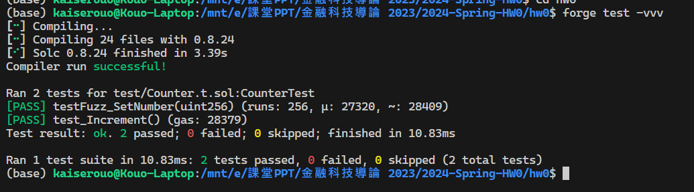
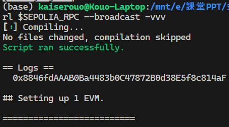
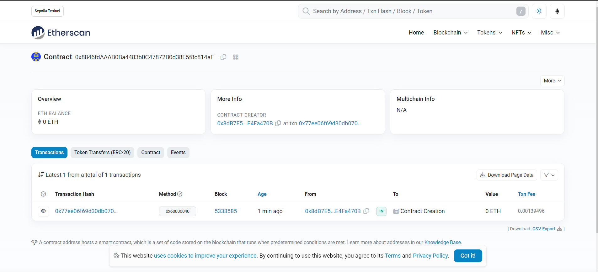

# 2024-Spring-HW0

All the detailed specified in Homework 0 documentation.

## Wallet Address
Please provide your MetaMask wallet address: 0x8dB7E5B6499e94a9b3fb8298Da4b0a8bE4Fa470B

## Local Testing
Please provide a screenshot of the `forge test -vvv` command running in your local environment.

## Contract Address
Please provide the contract address that you deployed on the Sepolia network.

0x8846fdAAAB0Ba4483b0C47872B0d38E5f8c814aF

## Sepolia Etherscan
Paste the contract address into the Sepolia Etherscan and share the screenshot.
